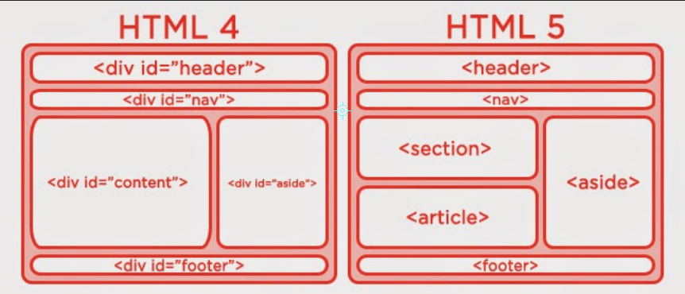

# HTML5
HTML5 es la última versión de HTML.

El término representa dos conceptos diferentes:

* Se trata de una nueva versión de HTML, con nuevos elementos, atributos y comportamientos.
* Contiene un conjunto más amplio de tecnologías que permite a los sitios Web y a las aplicaciones ser más diversas y de gran alcance. A este conjunto se le llama HTML5 y amigos, a menudo reducido a HTML5.

[Más información](https://developer.mozilla.org/es/docs/HTML/HTML5)

## Etiquetas nuevas de HTML5

## Etiquetas obsoletas

Etiqueta HTML | Definición
--------------|-----------
<acronym>     |
<applet>      |
<basefont>    |
<big>         |

      |
<dir>         |
        |
<frame>       |
<frameset>    |
<isindex>     |
<noframes>    |
<strike>      |
<tt>          |
